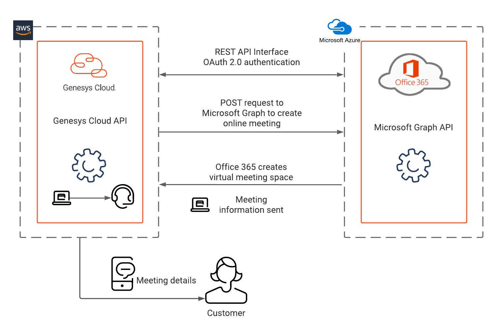
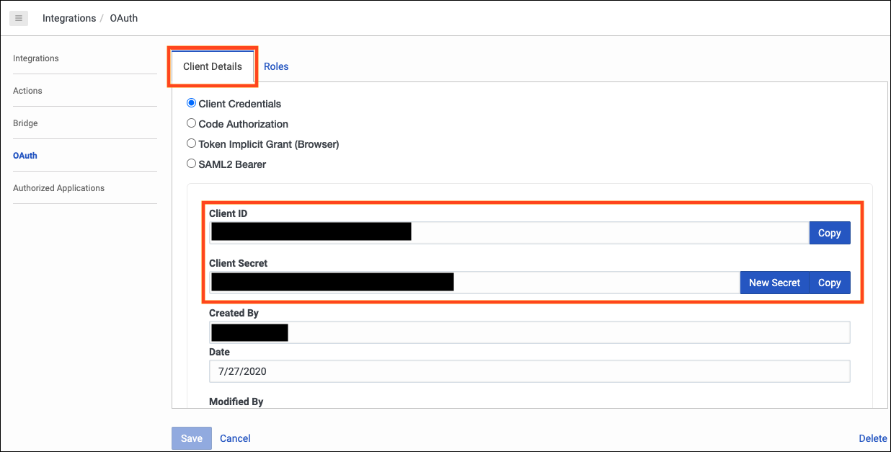

This Genesys Cloud Developer Blueprint explains how to set up Genesys Cloud and Microsoft 365 for agents to schedule a meeting with customers using Microsoft Teams. The agents can now directly schedule a Microsoft Teams meeting from Genesys Cloud. Genesys Cloud automatically sends an SMS message with the meeting URL to the customer and also opens the Microsoft Teams for the agent. The call can be either inbound or outbound as long it is in a queue. 
The following illustration shows the meeting scheduling solution from an agent’s point of view.

To enable an agent to use Microsoft Teams meeting from their Genesys Cloud agent UI, you use several public APIs that are available from Genesys Cloud and Microsoft Graph. The following illustration shows the API calls between Genesys Cloud and Microsoft 365.

* [Solution components](#solution-components "Goes to the Solution components section")
* [Prerequisites](#prerequisites "Goes to the Prerequisites section")
* [Implementation steps](#implementation-steps "Goes to the Implementation steps section")
* [Additional resources](#additional-resources "Goes to the Additional resources section")
  
## Solution components
* **Genesys Cloud** - A suite of Genesys cloud services for enterprise-grade communications, collaboration, and contact center management. Contact center agents use the Genesys Cloud user interface.
* **Genesys Cloud API** - A set of RESTful APIs that enables you to extend and customize your Genesys Cloud environment. The Genesys Cloud API for agentless SMS notification sends the meeting information to the caller.
* **Amazon Web Services** - Amazon Web Services (AWS), a cloud computing platform that provides a variety of cloud services such as computing power, database storage, and content delivery. AWS hosts Genesys Cloud.
* **Microsoft 365** - An integrated, cloud suite of productivity apps. This solution uses one of the apps, namely Microsoft Teams to schedule meetings.
* **Microsoft Teams** - A meeting and communication app. Microsoft Teams is the app that hosts the meeting for our solution.
* **Microsoft Graph** - A unified API endpoint that enables developers to integrate services and devices with Microsoft products. This solution uses the API endpoint to create a meeting in Microsoft Teams.
* **Microsoft Azure** - A cloud computing platform that provides a variety of cloud services for building, testing, deploying, and managing applications through Microsoft-managed data centers. Microsoft Azure hosts Microsoft 365.

## Prerequisites

### Specialized knowledge

* Administrator-level knowledge of Genesys Cloud
* Administrator-level knowledge of Microsoft Azure Active Directory
* REST API authentication
* Genesys Cloud scripting

### Genesys Cloud account

* A Genesys Cloud 3 license with agentless SMS functionality. For more information, see [Genesys Cloud Pricing](https://www.genesys.com/pricing "Opens the pricing article").
* The Master Admin role in Genesys Cloud. For more information, see [Roles and permissions overview](https://help.mypurecloud.com/?p=24360 "Opens the Roles and permissions overview article") in the Genesys Cloud Resource Center.

### Microsoft account

* Admininstrator-level role for Microsoft Azure Active Directory to set up authorization and grant permissions for Genesys Cloud. 
* Microsoft Teams license for agents.

## Implementation steps
* [Configure the Microsoft Azure custom app](#configure-the-microsoft-azure-custom-app "Goes to the Configure the Microsoft Azure custom app section")
* [Configure Genesys Cloud](#configure-genesys-cloud "Goes to the Configure Genesys Cloud section")
* [Add a web services data actions integration](#add-a-web-services-data-actions-integration "Goes to the Add a web services data actions integration section")
* [Create an OAuth client for use with the Genesys Cloud data action integration](#create-an-oauth-client-for-use-with-the-genesys-cloud-data-action-integration "Goes to the Create an OAuth client for use with the Genesys Cloud data action integration section")
* [Add a Genesys Cloud data actions integration](#add-a-genesys-cloud-data-actions-integration "Goes to the Add a Genesys Cloud data actions integration section")
* [Load the supporting data actions](#load-the-supporting-data-actions "Goes to the Load the supporting data actions section")
* [Import Create Teams video meeting data action](#import-create-teams-video-meeting-data-action "Goes to the Import Create Teams video meeting data action section")
* [Send SMS data action](#send-sms-data-action "Goes to the Send SMS data action section")
* [Import and publish the script](#import-and-publish-the-script "Goes to the Import and publish the script section")
* [Test the deployment](#test-the-deployment "Goes to the Test the deployment section")
* [Additional resources](#additional-resources "Goes to the Additional resources section")

### Configure the Microsoft Azure custom app
To enable the Genesys Cloud instance to authenticate and retrieve user information from the Graph API for Microsoft Teams, register your custom application in Azure. 

1. Log in to the Azure portal.
2. Navigate to **App registrations** and click **New registration**.

   

3. Enter a name for the application and select the preferred supported account type. Any account type works for a single Genesys Cloud organization. Click **Register**.

   

4. On the application's **Overview** page, copy the **Application (client) ID** and **Directory (tenant) ID** for later use.
   
   

5. Navigate to **Certificates & secrets** and click **New client secret**.
   
   

6. Copy the client secret value for later use.

   :::primary
   **Note:** You cannot view or retrieve the client secret value later.
   :::

   

7. Verify that your Genesys Cloud permission exists in Azure.
   
   

### Configure Genesys Cloud

### Add a web services data actions integration
To enable communication from Genesys Cloud to Microsoft Azure and Microsoft Teams, you must add a web services data actions integration:

1. Install the **Web Services Data Actions** integration from Genesys Cloud. See [About the data actions integrations](https://help.mypurecloud.com/?p=209478 "Opens the data actions overview article").

   

2. Rename the web services data action and provide a short description.

   

3. Navigate to **Configuration** > **Credentials** and click **Configure**.

   

4. For **User Defined (OAuth)** credential type, add the following five fields, enter the required values, and then click **OK**:

* A: Set the client_id to the Application (client) ID from your Azure app.
* B: Set the client_secret to the Client Secret from your Azure app.
* C: Set the tenant_id to the Directory (tenant) ID from your Azure app.
* D: Set the scope to https://graph.microsoft.com/.default.
* E: Set the grant_type to client_credentials.

   

5. Import authentication data action

   You import an authentication data action into another data action. When you add a new web services data actions integration within an organization, Genesys Cloud creates a **Custom Auth** data action automatically.
   
   Navigate to **Integrations** > **Actions** and open the **Custom Auth** data action.

   

   1. At the bottom of the Custom Auth data action page, click **Viewing** to change the status of the data action from **Published** to **Draft**.
   2. Download the auth data action file *Office-365-Auth.customAuth.json* from the [microsoft-teams-blueprint](https://github.com/MyPureCloud/microsoft-teams-blueprint "Opens the GitHub repo") GitHub repository. Save this file to your local desktop to import it into Genesys Cloud.
   3. Click **Import** and browse to select the downloaded file.

      

   4. Click **Import Action** to import the custom auth data action.
   
      
      
   5. Click **Save & Publish**.
      :::primary
      **Note:** Click **Yes** in the Publish Action window to publish the data action. The import action modifies only the data action configuration and not the data action contract.
      :::

6.  Return to the web services data action integration and verify that the data action is in **Active** status.

### Create an OAuth client for use with the Genesys Cloud data action integration
To enable Genesys Cloud data action make requests to an organization, you must configure authentication with Genesys Cloud using an OAuth client.

1. Navigate to **Integrations** > **OAuth** and click **Add Client**.

   

2. Enter a name for the OAuth client and select **Client Credentials** as the Grant Type. Click the **Roles** tab and assign the roles for the OAuth client.

   :::primary
   **Note:** Select a custom role that includes the permission Messaging > Sms > Send. No default role includes this permission. To create a custom role, see the Custom roles information in [Roles and permissions overview](https://help.mypurecloud.com/?p=24360 "Opens the Roles and Permission overview article").
   :::

   

3. Click **Save** and record the Client ID and Client Secret values for later use. 

   

### Add a Genesys Cloud data actions integration
The Microsoft Teams video session URL is sent as an SMS to the customer from Genesys Cloud. To enable this SMS capability, you must add a Genesys Cloud data actions integration.

1. Install the **Genesys Cloud Data Actions** integration from Genesys Cloud. For more information, see [About the data actions integrations](https://help.mypurecloud.com/?p=209478 "Opens the Data Actions overview article").

   

2. Enter a name for the Genesys Cloud data action.

   

3. In the **Configuration** tab, select **Credentials** and click **Configure**.

   

4. Enter the OAuth **Client ID** and **Client Secret** that you noted in the [OAuth client creation](#create-an-oauth-client-for-use-with-the-genesys-cloud-data-action-integration "Goes to the Genesys Cloud data action section"). Click **OK** and save the data action.

   

5. Navigate to the main Integrations page and set the SMS data action integration to **Active**.

   

### Load the supporting data actions

To enable the **Send SMS** button which sends the Microsoft Teams video session URL to the customer, you must import two more data actions.
* [Import Create Teams video meeting data action](#import-create-teams-video-meeting-data-action "Goes to the Import Create Teams video meeting data action section")
* [Send SMS data action](#send-sms-data-action "Goes to the Send SMS data action section")

### Import Create Teams video meeting data action
The Create Teams Video Meeting data action uses the authenticated token supplied by other data actions to request a new Microsoft Teams video meeting URL.

1. Download the *Create-Teams-Meeting.custom.json* file from the [microsoft-teams-blueprint repo](https://github.com/MyPureCloud/microsoft-teams-blueprint "Opens the GitHub repo") GitHub repository. Save this file in your local desktop to import it into Genesys Cloud.

2. Navigate to **Integrations** > **Actions** and click **Import**.

   

3. Select the *Create-Teams-Meeting.custom.json* file and associate with the web services data action you created in the [Add a web services data actions integration](#add-a-web-services-data-actions-integration "Goes to the Add a web services data actions integration section") section and click **Import Action**.

   

### Send SMS data action
This data action creates and sends an SMS message that contains the Microsoft Teams video meeting URL to the customer. The Create Teams Video Meeting data action that you configured creates the URL.

1. Download the *Send-SMS.custom.json* file from the [microsoft-teams-blueprint repo](https://github.com/MyPureCloud/microsoft-teams-blueprint "Opens the GitHub repo") GitHub repository. Save this file in your local desktop to import it into Genesys Cloud.
2. Navigate to **Integrations** > **Actions** and click **Import**.

   

3. Select the *Send-SMS.custom.json* file and associate with the web services data action you created in the [Add a web services data actions integration](#add-a-web-services-data-actions-integration "Goes to the Add a web services data actions integration section") section and click **Import Action**.

   

### Import and publish the script
You need to import the script *Send-SMS-with-Teams-Video-URL.script* that references the created data actions. The script generates the **Escalate to Teams** button for agents during an active interaction with the customer. It also sends an SMS that contains the Microsoft Teams video URL to the customer.

1. Download the *Send-SMS-with-Teams-Video-URL.script* file from the [microsoft-teams-blueprint repo](https://github.com/MyPureCloud/microsoft-teams-blueprint "Opens the GitHub repo") GitHub repository. Save this file to your local desktop to import it into Genesys Cloud.  

2. Navigate to **Admin** > **Contact Center** > **Scripts** and click **Import**.

   

3. Select the downloaded *Send-SMS-with-Teams-Video-URL.script* file.

   

4. To publish the script for use in an outbound message, open the imported script.

   

5. In the Script menu, click **Publish**.

   

## Test the deployment
You can test the Create Teams video meeting URL data action within the data action.

1. Navigate to **Admin** > **Integrations** > **Actions** and select the Create Teams Video Meeting data action.

2. Navigate to **Setup** > **Test**, enter your user, startTime, endTime and timeZone, and then click **Run Action**.

    :::primary
    **Note:** Enter the time in ISO-8601 format.
    :::

   

## Additional resources

- [Create onlineMeeting](https://docs.microsoft.com/en-us/graph/api/application-post-onlinemeetings?view=graph-rest-1.0&tabs=javascript "Opens the Microsoft graph documentation") in the Microsoft Graph API Reference
- [About Scripting](https://help.mypurecloud.com/?p=54284 "Opens the Scripting overview article") in the Genesys Cloud Resource Center
- [Agentless SMS Notifications](https://developer.mypurecloud.com/api/tutorials/agentless-sms-notifications/index.html?language=java&step=1 "Opens the SMS tutorial") in the Genesys Cloud Developer Center
- [Auto Send SMS](https://developer.mypurecloud.com/api/tutorials/sms-sending/index.html?language=nodejs&step=1 "Opens the SMS Sending tutorial") in the Genesys Cloud Developer Center
